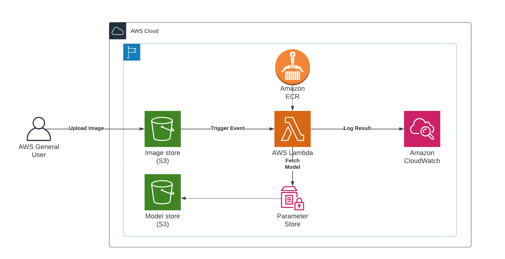

# DSTI AWS Inference Lambda
A simple and not-so-optimized implementation of AWS Lambda for inference. Created purely for practice &
demonstration purposes during the AWS Cloud Computing Class at [Data ScienceTech Institute](https://www.datasciencetech.institute/) 
in April 2022.

## Model
- Keras Computer Vision Code Examples: [Image Classification from Scratch](https://keras.io/examples/vision/image_classification_from_scratch/)

## Architecture

## Authors
**Maria SEBASTIAN**  <small>(Inference)</small>   
https://github.com/MSebastian2021/  
Applied MSc in Data Engineering for AI

**Albert KONRAD**  <small>(Lambda Implementation)</small>   
https://github.com/mralbertk/  
Applied MSc in Data Engineering for AI

## Instructor
**Assan SANOGO**  
assan.sanogo@dsti.institute  
Data Scientist